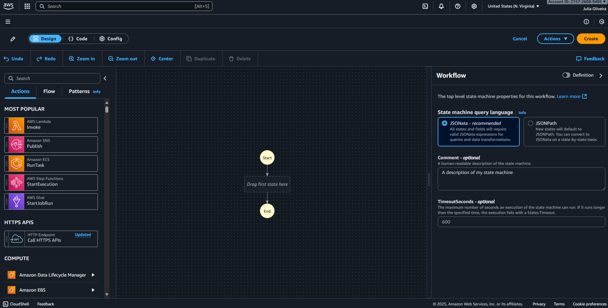
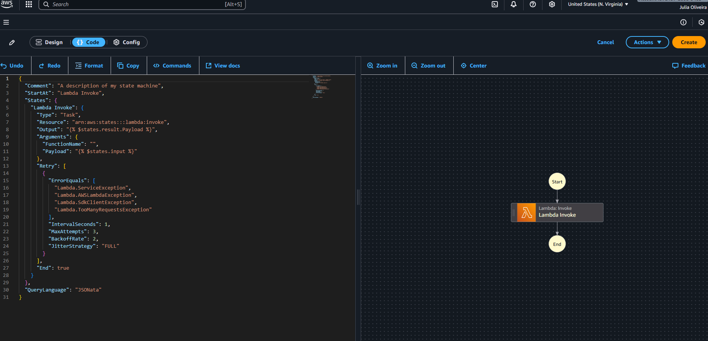

# AWS-Step-Functions


## 📌 O que é
O **AWS Step Functions** é um **construtor visual de workflows**, que facilita a **coordenação de serviços da AWS e microsserviços** através de fluxos de trabalho visuais.  
Ele permite organizar processos complexos em etapas claras, com suporte a validações, paralelismo, tratamento de erros e integrações nativas com outros serviços da AWS.

---

## 🎯 Por que usar
- Fornece uma **visão clara do processo** do início ao fim.  
- Ajuda a reduzir o acoplamento entre serviços.  
- Permite **fluxos robustos**, com Choice, Retry/Catch, Timeout, Parallel e Map.  
- Garante **observabilidade**, com histórico de execuções, métricas e logs.  
- Podemos **modelar o fluxo antes** de já ter todos os recursos criados.

---

## 🖼️ Exemplo de Diagrama
Fluxo: **Validar conta → se válido, grava no DynamoDB → senão, falha.**

- **Start** → início do workflow.  
- **Lambda (Validate account data)** → função Lambda para validar os dados.  
- **Choice (Account valid?)** → desvia o fluxo conforme a validação.  
- **Rule #1** → condição (se válido, segue adiante).  
- **Default** → caminho alternativo (caso não seja válido).  
- **DynamoDB PutItem** → gravação do resultado em uma tabela DynamoDB.  

---

## 🛠️ Construção do Fluxo
- Não é necessário ter todos os recursos prontos para começar.  
- É possível **criar o workflow primeiro** e depois apontar para os ARNs corretos (Lambda, DynamoDB, etc).  
- Dá para **testar com payloads mock** antes de integrar os serviços de verdade.

---

## 🧩 Workflow Studio + Application Composer
- O **Workflow Studio** também está integrado ao **AWS Application Composer** e ao **VS Code Toolkit**.  
- Isso facilita a criação do fluxo arrastando e soltando componentes.  
- Novos recursos:  
  - **HTTP Endpoints** → integração direta com APIs HTTPS.  
  - **API TestState** → permite testar estados individuais antes de rodar o fluxo completo.  

---

## ⚙️ Blocos Básicos
- **Task** → executa ações (Lambda, DynamoDB, SQS, HTTP...).  
- **Choice** → desvio condicional (if/else).  
- **Pass** → só transforma dados.  
- **Wait** → aguarda tempo/data.  
- **Parallel** → executa ramos simultâneos.  
- **Map** → iteração sobre listas.  
- **Succeed/Fail** → termina o fluxo com sucesso/erro.  

---

## 🖥️ Workflow Studio — Tela Inicial


➡️ Aqui temos a interface inicial do **Workflow Studio**.  
- O fluxo começa em **Start** e termina em **End**.  
- Podemos arrastar serviços da AWS (Lambda, SNS, DynamoDB, HTTP APIs etc.) para montar o workflow.  
- À direita, é possível configurar:  
  - **Comentário** (descrição da state machine),  
  - **TimeoutSeconds** (tempo máximo da execução),  
  - E a linguagem de query recomendada (**JSONata**).  

---

## ⚡ Adicionando uma Função Lambda


➡️ Neste print, arrastei e conectei o estado **Lambda Invoke** ao fluxo.  
- Essa task é responsável por chamar uma função Lambda dentro do fluxo.  
- O Step Functions já adiciona automaticamente as conexões entre **Start → Lambda → End**.  
- Essa função pode ser configurada para receber parâmetros de entrada, validar dados e devolver um resultado que será usado nos próximos estados.  

---

## 📑 Exemplo em JSON

```json
{
  "Comment": "Validação de conta e gravação no DynamoDB",
  "StartAt": "ValidateAccount",
  "States": {
    "ValidateAccount": {
      "Type": "Task",
      "Resource": "arn:aws:states:::lambda:invoke",
      "Parameters": {
        "FunctionName": "arn:aws:lambda:REGIAO:CONTA:function:validate-account",
        "Payload.$": "$"
      },
      "ResultPath": "$.validation",
      "Retry": [
        {
          "ErrorEquals": ["Lambda.ServiceException", "Lambda.AWSLambdaException", "Lambda.SdkClientException"],
          "IntervalSeconds": 2,
          "MaxAttempts": 3,
          "BackoffRate": 2.0
        }
      ],
      "Catch": [
        {
          "ErrorEquals": ["States.ALL"],
          "ResultPath": "$.error",
          "Next": "ValidationFailed"
        }
      ],
      "Next": "AccountValid?"
    },
    "AccountValid?": {
      "Type": "Choice",
      "Choices": [
        {
          "Variable": "$.validation.Payload.isValid",
          "BooleanEquals": true,
          "Next": "PutItemDynamoDB"
        }
      ],
      "Default": "ValidationFailed"
    },
    "PutItemDynamoDB": {
      "Type": "Task",
      "Resource": "arn:aws:states:::dynamodb:putItem",
      "Parameters": {
        "TableName": "Accounts",
        "Item": {
          "accountId": { "S.$": "$.validation.Payload.accountId" },
          "status":    { "S": "VALID" }
        }
      },
      "End": true
    },
    "ValidationFailed": {
      "Type": "Fail",
      "Error": "AccountInvalid",
      "Cause": "Conta inválida ou erro na validação"
    }
  }
}
